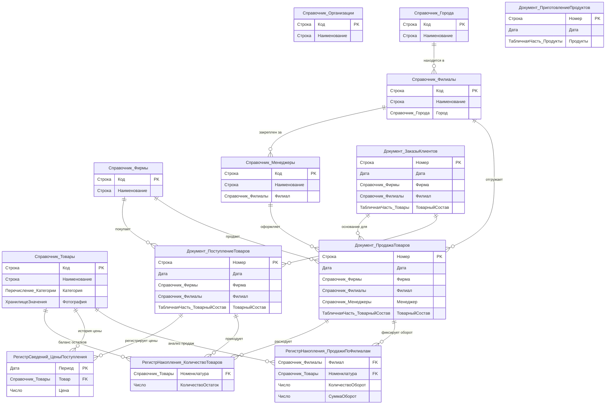

# 🚀 My_1C_Config: Автоматизация торгового учета и склада на платформе 1С:Предприятие 8.3

[](https://1c.ru)
[](https://v8.1c.ru/platforma/upravlyaemoe-prilozhenie/)
[](https://v8.1c.ru/platforma/interfeys-taksi/)
[-success?style=for-the-badge)](https://github.com/AlenaVelet/My_1C_Config)

## 📋 О проекте

**My_1C_Config** — это комплексная бизнес-ориентированная конфигурация, разработанная на платформе **1С:Предприятие 8.3** с использованием механизма **управляемых форм**. Проект представляет собой полноценную ERP/торговую систему начального уровня, автоматизирующую ключевые контуры предприятия: складской учет, управление закупками и продажами, ведение ценовой политики, а также аналитическую отчетность.

Этот репозиторий спроектирован по модульному принципу и наглядно демонстрирует **эволюцию разработки** информационной системы — от проектирования базовой структуры метаданных до реализации сложных транзакционных механизмов, интеграции с внешними источниками и построения гибких отчетов в системе СКД.

---

## 📊 Архитектурная модель данных (ERD Diagram)

Для визуализации объектной структуры базы данных торговой конфигурации разработана подробная Entity-Relationship-диаграмма (ERD) в русскоязычной терминологии «1С». Она наглядно иллюстрирует взаимосвязи между справочниками, документами, периодическими регистрами сведений и регистрами накопления:



---

## 🛠 Ключевые продемонстрированные компетенции

В ходе реализации проекта были успешно решены сложные архитектурные и алгоритмические задачи, соответствующие требованиям к специалистам уровня **Junior / Junior+ 1С-разработчик**:

### 1. Проектирование архитектуры базы данных (Metadata Engineering)
*   **Справочники:** Разработана иерархическая структура данных для ведения учета организаций, товаров (с поддержкой хранения медиаданных), филиальной сети, городов и менеджеров.
*   **Документы:** Создана система сквозного документооборота — от планирования (`ЗаказыКлиентов`) до фактического поступления (`ПоступлениеТоваров`) и отгрузки (`ПродажаТоваров`).
*   **Журналы документов:** Реализован единый реестр документов торгового контура для удобства пользователей.

### 2. Транзакционный учет и регистры (Business Logic & Registers)
*   **Регистры накопления:**
    *   `КоличествоТоваров` (тип *Остатки*): Обеспечивает оперативный контроль и учет остатков на складах.
    *   `ПродажиПоФилиалам` (тип *Обороты*): Накапливает исторические данные о продажах для дальнейшего анализа динамики филиалов.
*   **Регистры сведений:**
    *   `ЦеныПоступления` (периодический, в разрезе номенклатуры): Реализует хранение истории цен поступления. Для оптимизации получения цен на лету разработан программный интерфейс работы с регистром через специализированный общий модуль (метод «СрезПоследних»).

### 3. Обеспечение транзакционной целостности и контроль остатков
*   **Контроль отрицательных остатков:** В модуле проведения документа `ПродажаТоваров` реализован отказоустойчивый алгоритм проверки остатков в транзакции. 
    *   *Принцип работы:* Блокировка данных 1С ➡️ Выполнение запроса к актуальным остаткам регистра с учетом проводимого документа ➡️ Анализ дефицита товара ➡️ Отказ в проведении с выводом информативного сообщения пользователю. Такой подход исключает коллизии при конкурентной работе пользователей (проблема "Race Condition").

### 4. Программирование интерфейса и Управляемые формы (UI/UX & Client-Server)
*   **Оптимизация контекста:** Код форм спроектирован с учетом клиент-серверной архитектуры платформы 1С. Реализовано четкое разграничение директив компиляции (`&НаКлиенте`, `&НаСервере`, `&НаСервереБезКонтекста`). Минимизированы неявные серверные вызовы без контекста формы для повышения производительности приложения.
*   **Интерактивные элементы формы:** Использование обработчиков событий (например, автоматический расчет сумм при изменении цены или количества, процедура `ОбработкаИзмененияПродукта`).
*   **Динамические списки и Деревья значений:** Реализовано продвинутое отображение списков документов и справочников с кастомной фильтрацией, условным оформлением и группировкой данных.

### 5. Интеграция, импорт данных и работа с бинарными данными
*   **Программный импорт:** Разработан механизм загрузки справочных данных («Товары», «Города», «Фирмы») из внешних файлов.
*   **Работа с медиафайлами:** Реализована логика пакетного импорта и привязки графических изображений (фотографий товаров) к карточкам номенклатуры, хранение картинок в базе данных и их динамическое отображение на управляемой форме.

### 6. Аналитическая отчетность и печатные формы (Reporting & Layouts)
*   **Система компоновки данных (СКД):** 
    *   Разработаны сложные аналитические отчеты (тип «Список» и тип «Диаграмма») с использованием механизмов группировки, детальных записей и кастомных настроек СКД.
    *   Созданы **внешние отчеты** для обеспечения модульности и простоты обновления системы без изменения основной конфигурации.
*   **Печатные формы:** Создана печатная форма для документа `Поступление товаров` с использованием табличных макетов и параметров заполнения.

---

## 📂 Структура репозитория и хронология разработки

Репозиторий имеет четкую хронологическую структуру, соответствующую этапам проектирования ИС. Каждый шаг представлен отдельной папкой с выгрузкой конфигурации (Configuration XML Dump) или zip-архивом:

1.  📁 **`Элементы конфигурации`** — Проектирование базовых метаданных (справочники, документы, перечисления).
2.  📁 **`Обработка документов и регистры`** — Подключение регистров сведений и накопления, базовая программная обработка проведения.
3.  📁 **`Механизмы сохранения и обработки данных`** — Печатные формы, ввод на основании документов, создание журнала документов и транзакционный контроль отрицательных остатков.
4.  📁 **`Управляемые формы 1С 8.3`** — Разработка интерактивного интерфейса, программирование клиент-серверного взаимодействия форм.
5.  📦 **`Отчеты и обработки.zip`** — Сборник отчетов на базе СКД, макетов печати, внешних отчетов и обработок.
6.  📁 **`Импорт данных`** — Самая полная итоговая конфигурация (включает механизмы программного импорта справочников и картинок, настройки интерфейса подсистем и корпоративного стиля).
7.  📦 **`Динамический список и Дерево значений.zip`** — Дополнительный специализированный модуль, демонстрирующий навыки работы со сложными визуальными интерфейсами 1С.

> **💡 Рекомендация для ревьюера:** Для ознакомления с финальной, наиболее функциональной версией конфигурации используйте файлы из каталога **`Импорт данных`** или архив **`Динамический список и Дерево значений.zip`**.

---

## 💻 Примеры реализации (Best Practices)

### Оптимизированный контроль остатков при проведении (Модуль проведения)
```bsl
// Пример реализации отказоустойчивого контроля остатков в транзакции
Процедура ОбработкаПроведения(Отка, РежимПроведения)
	
	// 1. Установка блокировки на регистр остатков номенклатуры
	Блокировка = Новый БлокировкаДанных;
	ЭлементБлокировки = Блокировка.Добавить("РегистрНакопления.КоличествоТоваров");
	ЭлементБлокировки.Режим = РежимБлокировкиДанных.Исключительный;
	ЭлементБлокировки.ИсточникДанных = ТоварныйСостав;
	ЭлементБлокировки.ИспользоватьИзИсточникаДанных("Номенклатура", "Товар");
	Блокировка.Заблокировать();
	
	// 2. Формирование движений по регистру
	Движения.КоличествоТоваров.Записывать = Истина;
	Движения.КоличествоТоваров.Записать(); // Очищаем старые движения в случае перепроведения
	
	Для Каждого ТекСтрока Из ТоварныйСостав Цикл
		Движение = Движения.КоличествоТоваров.ДобавитьРасход();
		Движение.Период = Дата;
		Движение.Номенклатура = ТекСтрока.Товар;
		Движение.Количество = ТекСтрока.Количество;
	КонецЦикла;
	
	// Записываем новые движения, чтобы запрос ниже увидел актуальное состояние системы
	Движения.КоличествоТоваров.Записать(); 
	
	// 3. Запрос для проверки возникновения отрицательных остатков
	Запрос = Новый Запрос;
	Запрос.Текст = 
		"ВЫБРАТЬ
		|	КоличествоТоваровОстатки.Номенклатура КАК Номенклатура,
		|	КоличествоТоваровОстатки.КоличествоОстаток КАК Остаток
		|ИЗ
		|	РегистрНакопления.КоличествоТоваров.Остатки(&МоментВремени, Номенклатура В (&СписокНоменклатуры)) КАК КоличествоТоваровОстатки
		|ГДЕ
		|	КоличествоТоваровОстатки.КоличествоОстаток < 0";
		
	Запрос.УстановитьПараметр("МоментВремени", Новый Граница(МоментВремени(), ГраницаТипа.Включая));
	Запрос.УстановитьПараметр("СписокНоменклатуры", ТоварныйСостав.ВыгрузитьКолонку("Товар"));
	
	РезультатЗапроса = Запрос.Выполнить();
	Если Не РезультатЗапроса.Пустой() Тогда
		Выборка = РезультатЗапроса.Выбрать();
		Пока Выборка.Следующий() Цикл
			Сообщение = Новый СообщениеПользователю;
			Сообщение.Текст = Шаблон("Недостаточно товара '%1' на складе. Дефицит составляет %2 ед.", 
				Выборка.Номенклатура, -Выборка.Остаток);
			Сообщение.Сообщить();
			Отка = Истина;
		КонецЦикла;
	КонецЕсли;
	
КонецПроцедуры
```

---

## 🖥 Галерея интерфейса (UI Screenshots)

Ниже представлены ключевые элементы интерфейса разработанного решения:

<table align="center">
  <tr>
    <td align="center"><b>Рабочее пространство пользователя</b><br><br><a href="https://github.com/user-attachments/assets/fc954380-6581-4afe-a5b4-6ed495aac735" target="_blank"></a></td>
    <td align="center"><b>Форма списка справочника</b><br><span style="font-size:0.85em; color:#586069;">(управляемая форма)</span><br><br><a href="https://github.com/user-attachments/assets/a9a04f54-74ea-4feb-9c9c-a68461fbdf81" target="_blank"></a></td>
    <td align="center"><b>Отчет по продажам</b><br><span style="font-size:0.85em; color:#586069;">(диаграмма СКД)</span><br><br><a href="https://github.com/user-attachments/assets/09fdd9b7-3d00-4d59-96c1-25a96aaf4acc" target="_blank"></a></td>
  </tr>
  <tr>
    <td align="center"><b>Список продаж</b><br><span style="font-size:0.85em; color:#586069;">(динамический список)</span><br><br><a href="https://github.com/user-attachments/assets/42522b66-3611-4749-ae52-282fe6da3fcc" target="_blank"></a></td>
    <td align="center"><b>Карточка номенклатуры</b><br><span style="font-size:0.85em; color:#586069;">(с фотографией)</span><br><br><a href="https://github.com/user-attachments/assets/749a079b-91d8-48d9-9162-552f788185ee" target="_blank"></a></td>
    <td align="center"><b>Отчет по продажам</b><br><span style="font-size:0.85em; color:#586069;">(табличный вид СКД)</span><br><br><a href="https://github.com/user-attachments/assets/fd895cba-c596-4acf-a960-bc59e916daf2" target="_blank"></a></td>
  </tr>
</table>

> **Примечание:** Отчет по продажам представлен в двух режимах — диаграмма и таблица.

---

## 🚀 Как развернуть и протестировать конфигурацию

1.  **Скачайте проект:**
    Клонируйте репозиторий или скачайте его в виде ZIP-архива:
    ```bash
    git clone https://github.com/AlenaVelet/My_1C_Config.git
    ```
2.  **Запустите Конфигуратор:**
    Откройте пустую базу данных в «1С:Предприятие» в режиме **Конфигуратора**.
3.  **Загрузите конфигурацию:**
    *   *Вариант А (из XML-выгрузки):* Перейдите в меню `Конфигурация` ➡️ `Выгрузить/загрузить конфигурацию` ➡️ `Загрузить конфигурацию из файлов...`. Выберите папку `Импорт данных` (или любую другую интересующую вас стадию).
    *   *Вариант Б (из архива):* Распакуйте `Динамический список и Дерево значений.zip` и загрузите аналогичным образом.
4.  **Обновите базу данных:**
    Нажмите клавишу `F7` (или `Конфигурация` ➡️ `Обновить конфигурацию базы данных`).
5.  **Запустите отладку:**
    Нажмите `F5` для запуска системы в режиме «1С:Предприятие» (управляемое приложение) и протестируйте функционал.

> **💡 Совет для быстрого старта:** В конфигурации настроен автоматический импорт справочников и демо-данных, что позволяет начать работу и формировать отчеты СКД сразу после первого запуска.

---

## 👨‍💻 Об авторе

**Велет Алена**  
Начинающий, целеустремленный разработчик на платформе «1С:Предприятие 8.3». Специализируюсь на проектировании учетных систем, разработке управляемых форм, оптимизации клиент-серверного взаимодействия и построении аналитической отчетности СКД.

*   📱 **Telegram:** [@kisakisynia](https://t.me/kisakisynia)
*   📧 **E-mail:** `mikilunat_t@mail.ru`
*   💻 **GitHub:** [AlenaVelet](https://github.com/AlenaVelet)

---
*Буду рада обсудить вакансии, стажировки или совместные проекты в сфере 1С-разработки!*
